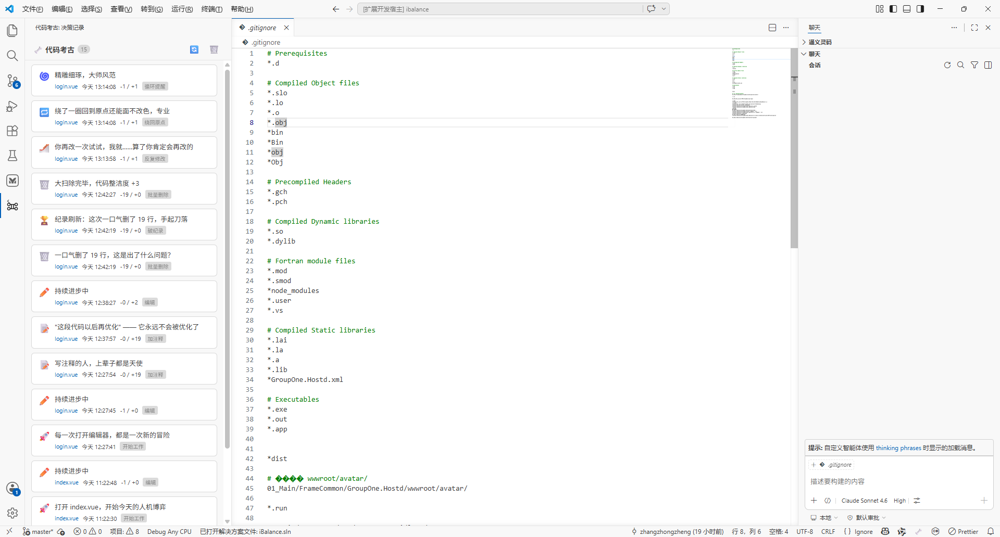

# 🦴 代码考古 (Code Archaeology)

记录你写代码时**放弃过的路**——每一次删除、替换、重构，都是你的决策化石。



## 功能

- **自动追踪**：保存文件时自动记录代码变动
- **智能分类**：识别删函数、删批量、换方案、绕回原点、删调试、深夜写码、破纪录、循环提醒、放弃成本等多类事件
- **趣味评语**：每种事件有 8 种不同语气的随机评语（幽默、毒舌、鼓励、哲学……）
- **多种风格**：支持 balanced / gentle / brutal / poetic / silent 五种评语风格可调
- **减少刷屏**：开工类提示按天收敛，不会每切到一个新文件就重复刷一条
- **侧边栏视图**：活动栏点击化石图标即可查看，按时间倒序排列
- **点击展开**：点击记录卡片可查看被删代码上下文

## 使用

1. 安装后在活动栏（左侧）会出现 🦴 化石图标
2. 点击图标打开「代码考古」侧边栏
3. 正常写代码、保存文件，记录会自动出现
4. 点击记录行可展开查看详情
5. 点击文件名可跳转到对应文件

## 命令

- `打开代码考古` — 打开侧边栏
- `清空决策记录` — 清空所有记录

## 配置

| 设置 | 默认值 | 说明 |
|------|--------|------|
| `decisionArchaeologist.toneStyle` | `balanced` | 评语风格：balanced/gentle/brutal/poetic/silent |
| `decisionArchaeologist.maxRecords` | `1000` | 最大保留记录数 |

## 评语风格

- **balanced**：幽默与鼓励平衡
- **gentle**：温和鼓励为主
- **brutal**：毒舌扎心风格
- **poetic**：文艺诗意风格
- **silent**：只记录事实，不生成评语

## 开发

```bash
npm install
npm run compile
```

按 `F5` 启动扩展开发调试。
