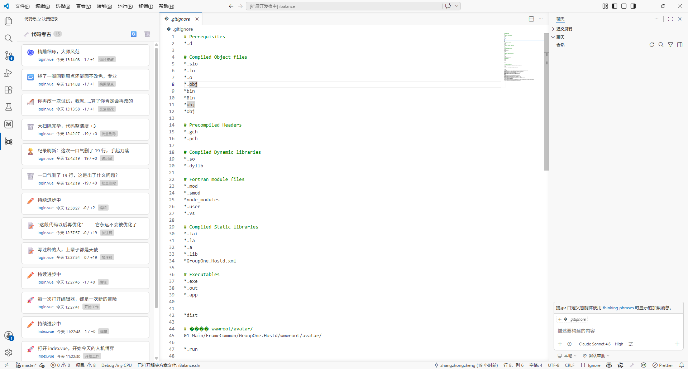

# 🦴 代码考古 (Code Archaeology)

记录你写代码时**放弃过的路**——每一次删除、替换、重构，都是你的决策化石。



## 功能

- **自动追踪**：保存文件时自动记录代码变动
- **智能分类**：44 种事件类型，覆盖删除、新增、修改、习惯与时间五大类
- **趣味评语**：每种事件都有多条不同语气的随机评语（幽默、调侃、鼓励、毒舌、哲学……）
- **多种风格**：支持 balanced / gentle / brutal / poetic / silent 五种评语风格可调
- **减少刷屏**：开工类提示按天收敛，不会每切到一个新文件就重复刷一条
- **目录排除**：默认忽略 node_modules / dist / out / 锁文件等，避免构建产物污染记录
- **侧边栏视图**：活动栏点击化石图标即可查看，支持按天分组折叠、关键词与类别筛选、排序
- **统计面板**：类型分布、删除最多的文件、最近 7 天趋势
- **复制与导出**：一键复制被删代码、导入导出 Markdown / JSON 报告

## 事件类型

**删除类**：删函数、批量删除、少量删除、删测试、删旧代码、删注释、删防御性判断、删错误处理、清空文件、清理调试、清 TODO

**新增类**：新增代码块、新增注释、写下 TODO

**修改类**：换方案、重构、微调、修小错、格式调整、配置变更、依赖变更、整理导入、批量重命名、改测试、复制粘贴、注释掉代码、取消注释、函数反复增删

**习惯类**：绕回原点、秒写秒删、反复修改、循环提醒、放弃成本、破纪录、沉没成本、多文件改动、连续凌晨、模式发现、自相矛盾、空手而归

**时间类**：早晨开工、深夜编码、开始工作

## 使用

1. 安装后在活动栏（左侧）会出现 🦴 化石图标
2. 点击图标打开「代码考古」侧边栏
3. 正常写代码、保存文件，记录会自动出现
4. 点击记录行可展开详情，或右键打开操作菜单
5. 点击文件名可跳转到对应文件

## 命令

- `打开代码考古` — 打开侧边栏
- `清空决策记录` — 清空所有记录

## 配置

| 设置 | 默认值 | 说明 |
|------|--------|------|
| `decisionArchaeologist.toneStyle` | `balanced` | 评语风格：balanced/gentle/brutal/poetic/silent |
| `decisionArchaeologist.maxRecords` | `1000` | 最大保留记录数 |
| `decisionArchaeologist.minChangedLines` | `1` | 单次改动低于该行数不记录，用于过滤琐碎变更 |
| `decisionArchaeologist.retentionDays` | `0` | 记录保留天数，0 表示不按时间清理 |
| `decisionArchaeologist.exclude` | 见下 | 不记录的路径 glob 列表 |
| `decisionArchaeologist.disabledEvents` | `[]` | 关闭指定事件类型，不再生成对应记录 |

默认排除项：`node_modules`、`dist`、`out`、`build`、`coverage`、`target`、`vendor`、`.venv`、`__pycache__`、`.next`、`.cache`、`*.min.js`、`*.map` 以及各类锁文件。

## 评语风格

- **balanced**：幽默与鼓励平衡
- **gentle**：温和鼓励为主
- **brutal**：毒舌扎心风格
- **poetic**：文艺诗意风格
- **silent**：只记录事实，不生成评语

## 数据存储

记录保存在扩展全局存储目录的 `decisions.json` 中，带版本号，写入采用「临时文件 + 原子替换」并做了防抖，避免高频保存时产生抖动或损坏文件。

## 开发

```bash
npm install
npm run compile
npm test
```

按 `F5` 启动扩展开发调试。

